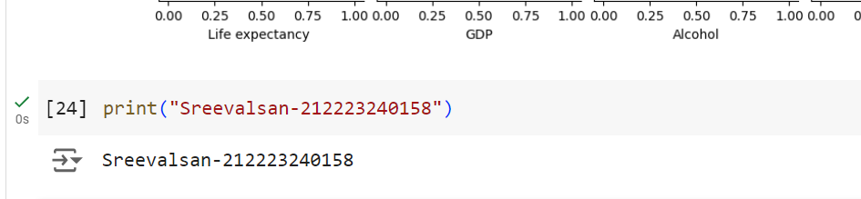

# AppDSExno-03

**AIM:**

To Implement Recommendation Systems using the suitable data sets.

**ALGORITHM:**

STEP 1: Load the necessary Datasets.

STEP 2: Include the necessary python library.

STEP 3: Use Fuzzy library for handling text data.

STEP 4: Perform Data Preprocessing Steps.

STEP 5: Standardize column names for merging.

STEP 6: Apply fuzzy matching to find similar text data between datasets.

STEP 7: Perform Data transformation between datasets.

STEP 8: Define a recommendation score using the features of the datasets.

STEP 9: Sort the data by recommendation score.

STEP 10: Export the results to a CSV file.


**CODING & OUTPUT**

```
import pandas as pd
import numpy as np
pip install pandas numpy scikit-learn fuzzywuzzy python-Levenshtein
```

```
from fuzzywuzzy import process
from sklearn.preprocessing import MinMaxScaler
df = pd.read_csv('/content/emobile.csv')
df.head()
```

```
dx = pd.read_csv('/content/maxmobile.csv')
dx.head()
```

```
df.drop_duplicates(inplace=True)
dx.drop_duplicates(inplace=True)
df.columns = ['Product_id','Product_Name','Rating','Review_Count']
def match_products(name,choices,limit=1):
  results = process.extract(name,choice,limit=limit)
  return results[0][0] if results else None
print(dx.columns)
print(df.columns)
```

```
dx.columns = dx.columns.str.strip()
print(dx.head())
df.drop_duplicates(inplace=True)
dx.drop_duplicates(inplace=True)
df.columns = ['Product_id','Product_Name','Rating','Review_Count']
dx.columns = ['Product_id','Product_Name','Rating','Review_Count']
```

```
def match_products(name,choices,limit=1):
  results = process.extract(name,choices,limit=limit)
  return results[0][0] if results else None
dx['Matched_Product'] = dx['Product_Name'].apply(lambda x: match_products(x,df['Product_Name'].tolist()))
merged_df = pd.merge(df, dx, left_on='Product_Name', right_on='Matched_Product', how='inner', suffixes=('_ds1', '_ds2'))
merged_df
```

```
merged_df.columns
x=merged_df['Review_Count_ds1'] + merged_df['Review_Count_ds2']
x=merged_df['Rating_ds1'] + merged_df['Rating_ds2']
merged_df['Combined_Rating'] = (merged_df['Rating_ds1'] * merged_df['Rating_ds1']+merged_df['Rating_ds2'] * merged_df['Rating_ds2'])/x
merged_df['Recommendatio_Score'] = 0.7* merged_df['Combined_Rating'] + 0.3 * merged_df['Rating_ds1']
merged_df.head()
```

```
best_products = merged_df.sort_values(by='Recommendatio_Score', ascending=False)
print(best_products[['Matched_Product', 'Combined_Rating', 'Recommendatio_Score']].head(10))
print(best_products.columns)
best_products.columns = best_products.columns.str.strip()  # Remove any leading or trailing spaces
best_products[['Matched_Product', 'Combined_Rating', 'Recommendatio_Score']].to_csv('best_recommended_products.csv', index=False)
```

```
rp=pd.read_csv('/content/best_recommended_products.csv')
rp.head()
```




**RESULT**

Thus, Recommendation Systems using the suitable data sets is implemented successfully.
