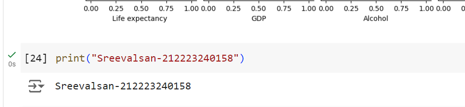

# EX01-Implemention of  Data Preprocessing and Data Analysis
## NAME: SREEVALSAN
## REGISTER NO: 212223240158
## AIM:
To implement Data analysis and data preprocessing using a data set

## ALGORITHM:
Step 1: Import the data set necessary

Step 2: Perform Data Cleaning process by analyzing sum of Null values in each column a dataset.

Step 3: Perform Categorical data analysis.

Step 4: Use Sklearn tool from python to perform data preprocessing such as encoding and scaling.

Step 5: Implement Quantile transfomer to make the column value more normalized.

Step 6: Analyzing the dataset using visualizing tools form matplot library or seaborn.

## CODING AND OUTPUT:

#### Importing Libararies

```PY
import pandas as pd
import numpy as np
pip install pandas numpy scikit-learn fuzzywuzzy python-Levenshtein
```

```
from fuzzywuzzy import process
from sklearn.preprocessing import MinMaxScaler
df = pd.read_csv('/content/emobile.csv')
df.head()
```


```py
df.info()
```


```py
df.isnull().sum()
```


```py
numerical_columns=df.select_dtypes(include=['number']).columns
numerical_columns
```


#### Data Cleaning

```py

columns_to_fill = [
    'Life expectancy ', 'Adult Mortality', 'Alcohol', 'Hepatitis B',
    ' BMI ', 'Polio', 'Total expenditure', 'Diphtheria ',
    'GDP', 'Population', 'Income composition of resources', 'Schooling'
]

# Filling missing values with median
df[columns_to_fill] = df[columns_to_fill].fillna(df[columns_to_fill].median())

df.isnull().sum()

```


#### Before Removing Outliers

```py

numerical_columns = ['Life expectancy ', 'Adult Mortality', 'infant deaths', 'Alcohol', 
                     'percentage expenditure', 'Hepatitis B', 'Measles ', ' BMI ', 
                     'under-five deaths ', 'Polio', 'Total expenditure', 'Diphtheria ', 
                     'GDP', 'Population', 'Income composition of resources', 'Schooling']

fig, axes = plt.subplots(nrows=4, ncols=4, figsize=(15, 12))  # Adjust rows/cols based on number of features
axes = axes.flatten()

for i, column in enumerate(numerical_columns):
    sns.boxplot(data=df, x=column, ax=axes[i])
    axes[i].set_title(column)

for j in range(i + 1, len(axes)):
    fig.delaxes(axes[j])

plt.tight_layout()
plt.show()

```


#### Removing Outliers using IQR 

```py

df_cleaned = df.copy()

for column in numerical_columns:
    Q1 = df_cleaned[column].quantile(0.25)
    Q3 = df_cleaned[column].quantile(0.75)
    IQR = Q3 - Q1

    lower_bound = Q1 - 1.5 * IQR
    upper_bound = Q3 + 1.5 * IQR

    df_cleaned = df_cleaned[(df_cleaned[column] >= lower_bound) & (df_cleaned[column] <= upper_bound)]

print("Shape of DataFrame after outlier removal:", df_cleaned.shape)

```


#### After Removing Outliers

```py
for i, column in enumerate(numerical_columns):
    sns.boxplot(data=df_cleaned, x=column, ax=axes[i])
    axes[i].set_title(column)

for j in range(i + 1, len(axes)):
    fig.delaxes(axes[j])

plt.tight_layout()
plt.show()

```


#### Identifying the categorical data and performing categorical analysis.

```py
categorical_columns = df_cleaned.select_dtypes(include=['object']).columns
print("Categorical Columns:", categorical_columns)

for column in categorical_columns:
    print(f"Value counts for {column}:")
    print(df_cleaned[column].value_counts())
    print("\n")

```


#### Bivariate and multivariate analysis

```py

plt.figure(figsize=(8, 6))
sns.scatterplot(x='GDP', y='Life expectancy ', data=df_cleaned)
plt.title('Scatter Plot: Life expectancy vs GDP')
plt.show()

```


```py
plt.figure(figsize=(8, 6))
sns.countplot(x='Year', hue='Status', data=df_cleaned)
plt.title('Count Plot: Year vs Status')
plt.xticks(rotation=90)
plt.show()

```


```py
# Grouped box plot: 'Life expectancy' by 'Status' and 'Year'
plt.figure(figsize=(10, 6))
sns.barplot(x='Year', y='Life expectancy ', hue='Status', data=df_cleaned)
plt.title('Life Expectancy by Year and Status')
plt.xticks(rotation=90)
plt.show()

```


#### Data Encoding

```py
le=LabelEncoder()
df_cleaned['Country']=le.fit_transform(df_cleaned['Country'])

be=BinaryEncoder()
nbe=be.fit_transform(df_cleaned['Status'])
df_cleaned=pd.concat([df_cleaned,nbe],axis=1)
df_cleaned.drop(columns=['Status'],inplace=True)

```
#### Data Scaling

```py

scaler=MinMaxScaler()
columns_to_scale=['Life expectancy ','infant deaths', 'Alcohol', 'Hepatitis B',
       ' BMI ', 'under-five deaths ', 'Polio', 'Total expenditure',
       'Diphtheria ', 'GDP', 'Income composition of resources',
       'Schooling']
df_cleaned[columns_to_scale]=scaler.fit_transform(df_cleaned[columns_to_scale])

rscaler=RobustScaler()
columns_to_rscaler=['Adult Mortality', 'percentage expenditure','Measles ', 'Population']
df_cleaned[columns_to_rscaler]=rscaler.fit_transform(df_cleaned[columns_to_rscaler])
df_cleaned.head()

```


#### Data Visualization

##### HeatMap
```py
corr_matrix = df_cleaned.corr()

plt.figure(figsize=(10, 6))
sns.heatmap(corr_matrix, annot=True, linewidths=0.5)
plt.title('Correlation Heatmap')
plt.show()

```


##### Pairplot
```py
selected_columns = ['Life expectancy ', 'GDP', 'Alcohol', ' BMI ', 'Schooling']
sns.pairplot(df_cleaned[selected_columns])
plt.suptitle('Pairplot of Selected Numerical Columns', y=1.02)
plt.show()

```





## RESULT:
Thus Data analysis and Data preprocessing implemeted using a dataset.
